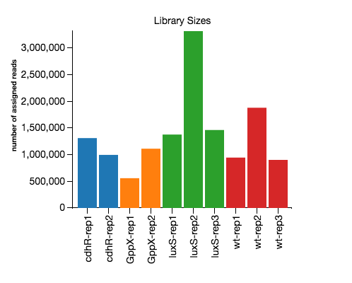
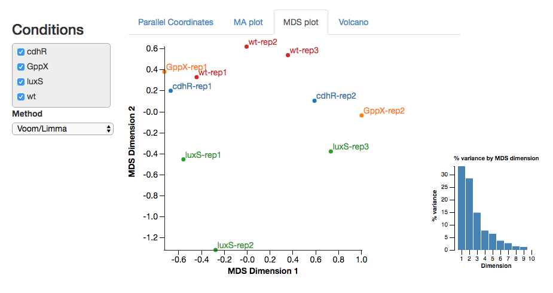
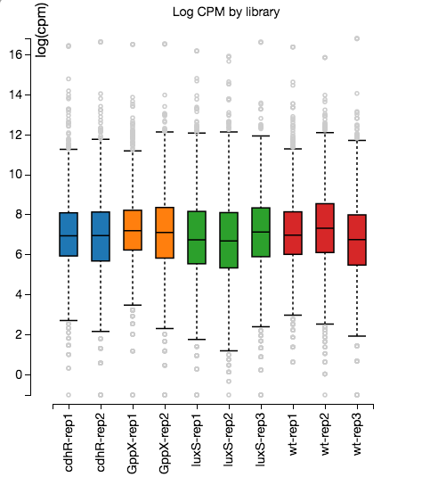
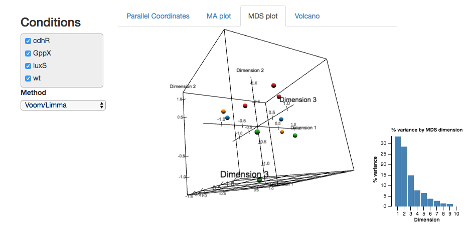

# Degust

* Visualise RNA-seq differential expression data.
* Perform your own DGE analysis, or use the inbuilt server to analyse from your own "counts" file.

Access a public web service running [Degust](http://degust.erc.monash.edu)

View a [short video](https://www.youtube.com/watch?v=ucucQ_LtZ1g) of the interface in use.

Read a summary on the <a href='http://drpowell.github.io/degust/'>Degust home page</a>.

## Example Screenshots

 

# FAQ

See [FAQ.md](FAQ.md)

# Installation

If you do not want to use the [public Degust installation](http://degust.erc.monash.edu), you may install your own.

You first need to grab a copy of Degust.

        git clone git@github.com:Victorian-Bioinformatics-Consortium/degust.git

Degust can be installed in two ways:

  1. Perform your own DGE analysis, and use only the [web frontend from Degust](#frontend-installation-only)
  2. Install the [frontend and back-end software](#full-installation) to perform analysis and visualise the results.

## Frontend installation only

To use the frontend visualisation, you will need to have done your own DGE analysis with a tool like edgeR or voom.  You will need CSV file contain a line per gene, and the following columns:

  * ID - containing a unique identifier for each gene (required)
  * Adjusted p-value - The adjusted p-value (FDR or similar) for that gene (required)
  * Log intensity for each condition - Used to compute the log fold-change (required)
  * Average intensity across the conditions - Used for the MA-plot (required)
  * Gene info - Arbitrary information columns to display in the gene list table (optional)
  * Read counts - Read counts for each replicate, only used for display purposes (optional)

The simplest approach is to download [degust.py](http://drpowell.github.io/degust/dist/latest/degust.py) then run it with your csv file as a parameter.  This will create a single HTML page that you view or share.  Run ``degust.py --help` to find the parameters to specify the column names for your CSV.

## Full installation

See [INSTALL.md](INSTALL.md)

## License ##
Degust is released under the GPL v3 (or later) license, see <a href='http://github.com/drpowell/degust/blob/master/COPYING.txt'>COPYING.txt</a>
