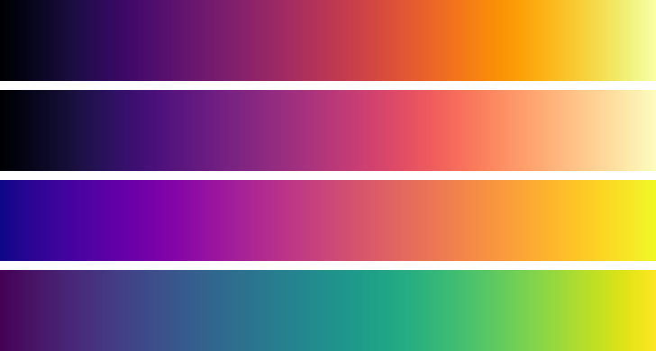

`scale-color-perceptual`
========================

> Javascript exports of matplotlib's new default color scales; inferno, magma, plasma and viridis. Works with browserify and D3.js

  
**Inferno, magma, plasma and viridis respectively**
Installation
------------

```bash
npm install scale-color-perceptual
```

Usage
-----

```js
const scale = require('scale-color-perceptual')

[0, 0.25, 0.5, 0.75, 1].map(scale.viridis) // Spits out the colors at the given points
```

Exports `scale.inferno(t)`, `scale.magma(t)`, `scale.plasma(t)` and
`scale.viridis(t)`, all taking scale parameter `t` in the range `[0, 1]`.
If a number is given outside this range is given **an `Error` will be thrown**.

Each of the scales has been put in the root of the module allowing you
to import only the scale you need, yielding a smaller JS file:

```js

const viridis = require('scale-color-perceptual/viridis')

[0, 0.25, 0.5, 0.75, 1].map(viridis) // Spits out the colors at the given
```

It can also be used with D3:

```js
const d3 = require('d3')
const plasma = require('scale-color-perceptual/plasma')

const depthScale = d3.scale.linear().domain([-100, 100]) // default range is [0, 1]
    .clamp(true) // Make sure the output is constrained to [0, 1]

d3.selectAll('div', document.body)
    .data(d3.shuffle(d3.range(-100, 100, 0.1)).map(n => Math.random() * n))
  .enter().append('div')
    .style({
      background: d => viridis(depthScale(d)),
      width: '10px',
      height: '10px',
      float: 'left'
    })
```

You can also import the raw color maps, either as `hex` or `rgb` triplets (`[r, g, b]`, where `c` is in `[0, 1]`):

```js
const d3 = require('d3')
const plasmaMap = require('scale-color-perceptual/hex/plasma') // returns 256 hex colors from dark to bright

const colorScale = d3.scale.quantize().domain([-128, 127]).range(plasmaMap)
```

Development
-----------

[`rgb/`](rgb/) contains raw JSON exports of the pixel `[r, g, b]` triplets
from [`bids/colormap`][1], which are the default color scales in matplotlib 2.0.
The pixel triplets were obtained from [`bids/colormap#84cb377`][2]. To build the
corresponding [`hex/`](hex/) files, run `make`.

License
-------

All credits go to Stéfan van der Walt and Nathaniel Smith for their work
devising these color scales. Remember to watch their [talk][1] on how it was
derived and how it is better than other common scales

The code in this repository is licensed under [ISC](LICENSE)

  [1]: http://bids.github.io/colormap/
  [2]: https://github.com/BIDS/colormap/blob/84cb3771a38dfe3d3977677df31af55f4ab7985e/colormaps.py
